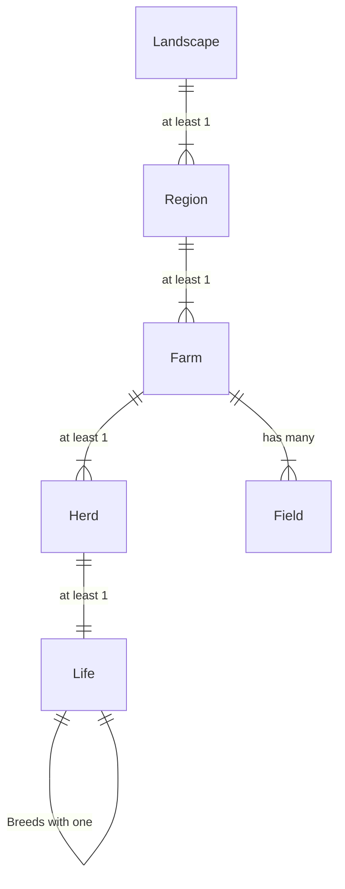

# Agrex.Schema

## Outline

- [Agrex.Schema](#agrexschema)
  - [Outline](#outline)
  - [Domain Model](#domain-model)

## Domain Model

```mermaid
erDiagram

    Landscape ||--|{ Region : "at least 1"
    Region ||--|{ Farm : "at least 1"
    Farm ||--|{ Herd : "at least 1"
    Herd ||--|| Life : "at least 1"
    Farm ||--|{ Field : "has many"
    Life ||--o{ Life : "Produces many"
    Life ||--|| Life : "Breeds with one"
    Field 


```