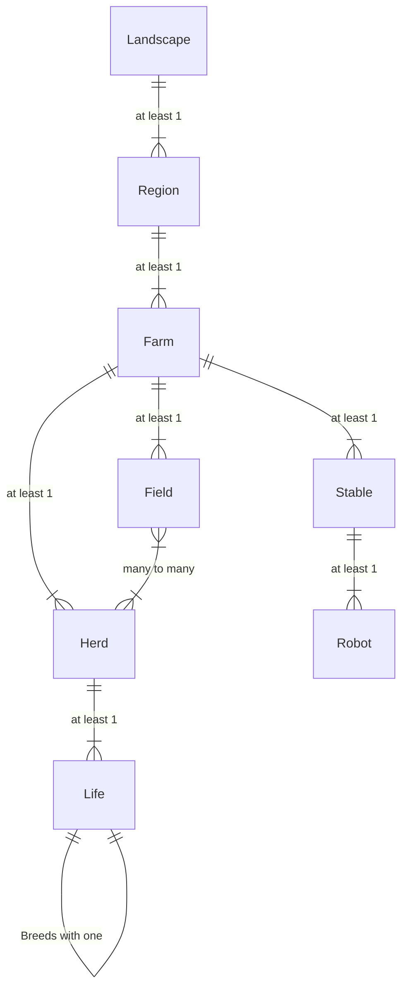

# Agrex.Schema

## Outline

- [Agrex.Schema](#agrexschema)
  - [Outline](#outline)
  - [Domain Model](#domain-model)

## Domain Model

The challenge we still face today, after a quarter of the 21st century has passed, is that many in the industry still gravitate towards a technology that originated in the 80s of the past century, a technology that was intended to save on storage (looking at you, RDBMS) and doesn't seem to care about data loss. (you too, evil CRUD)...We may only hope that one day they stop teaching this monstrosity. Sure, use it to store projections, if you must, but just record the facts on an endless tape you can listen to over and over again. 

Have a great weekend! 

