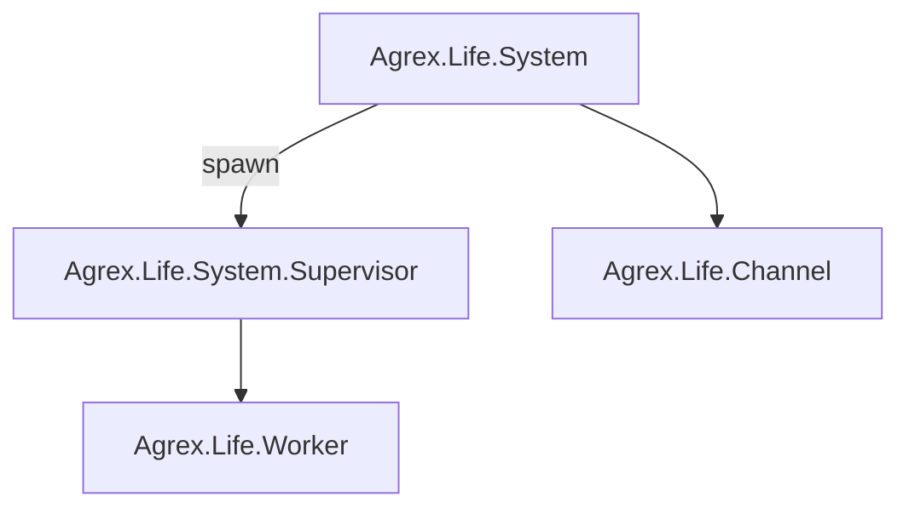

# Agrex.Life Subsystem

The Agrex.Life subsystem is responsible for controlling and simulating the life of farm animal.

## Outline 

- [Agrex.Life Subsystem](#agrexlife-subsystem)
  - [Outline](#outline)
  - [Actor diagram](#actor-diagram)

## Actor diagram

