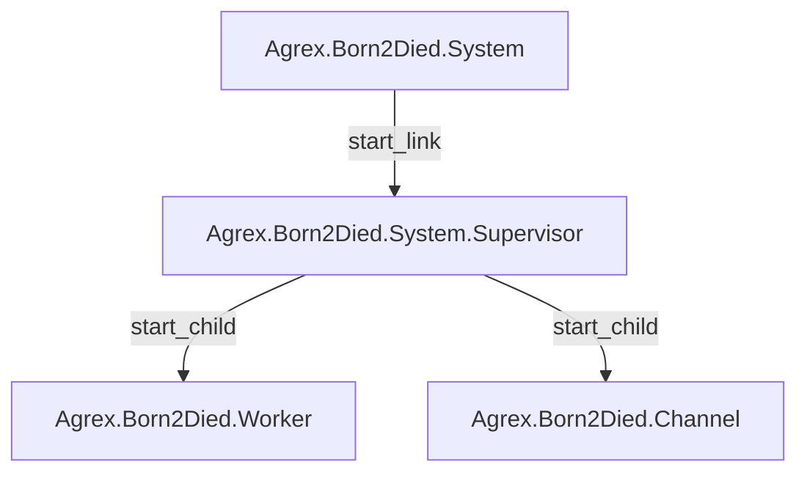
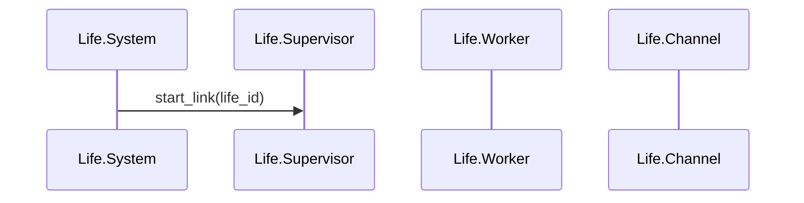

# Agrex.Born2Died Subsystem

The Agrex.Born2Died subsystem is responsible for controlling and simulating the life of farm animal.

## Outline

- [Agrex.Born2Died Subsystem](#agrexborn2died-subsystem)
  - [Outline](#outline)
  - [Diagrams](#diagrams)
    - [Actor diagram](#actor-diagram)
    - [Sequence diagram](#sequence-diagram)
  - [References](#references)
    - [Whiteboard](#whiteboard)

## Diagrams  

### Actor diagram

### Sequence diagram

## References

### Whiteboard

A whiteboard for this project can be found [here](https://lucid.app/lucidspark/3df9ee41-a400-404e-88e7-077037985398/edit?viewport_loc=-11012%2C-327%2C1280%2C662%2C0_0&invitationId=inv_46688d00-55d4-4cf8-8006-bcd038eed321)
