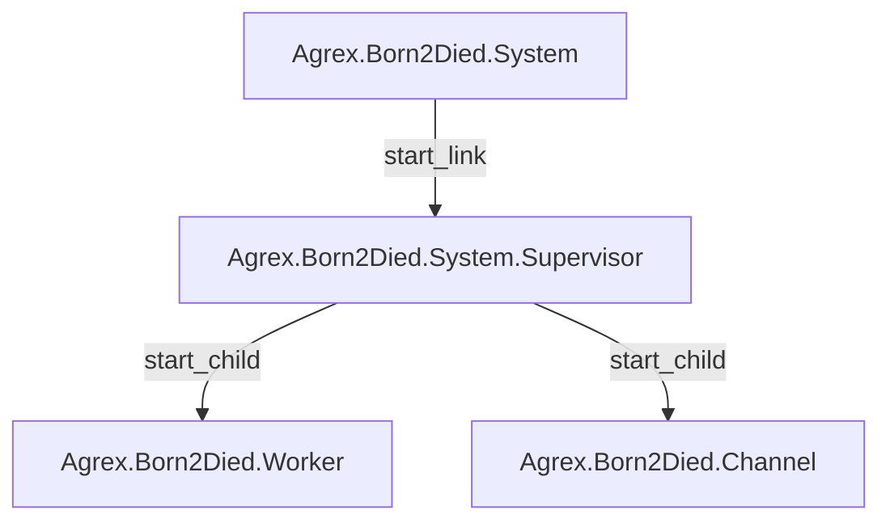
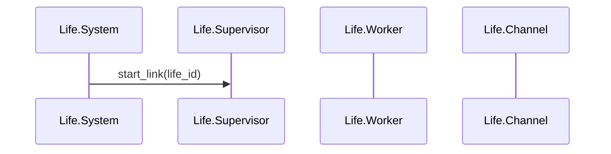

# Agrex.Born2Died Subsystem

The Agrex.Born2Died subsystem is responsible for controlling and simulating the life of farm animal.

## Outline

- [Agrex.Born2Died Subsystem](#agrexborn2died-subsystem)
  - [Outline](#outline)
  - [Actor diagram](#actor-diagram)
  - [Sequence diagram](#sequence-diagram)

## Actor diagram

## Sequence diagram

