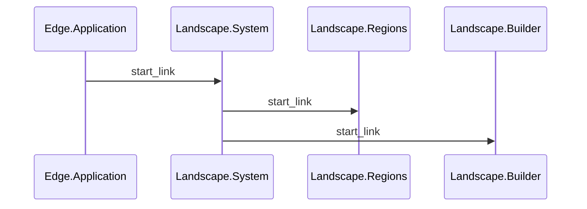

# Landscape System

## Description

**AgrexEdge.Landscape.System** is and AgrexEdge.Application subsystem that is responsible for managing the regions in the landscape.

## Diagrams

### Sequence Diagram

